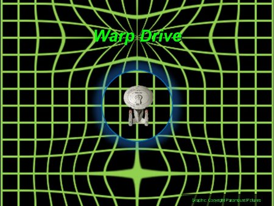
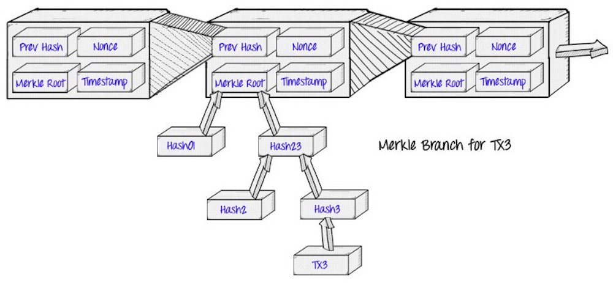
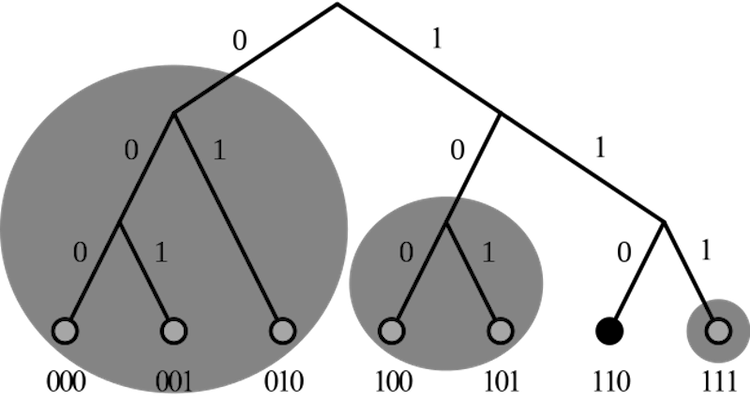
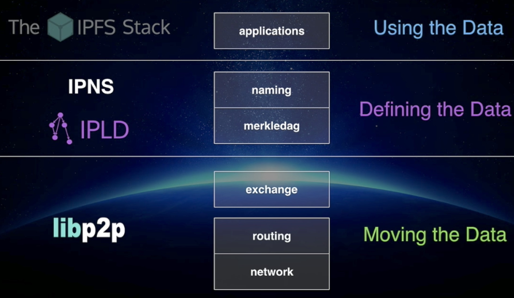
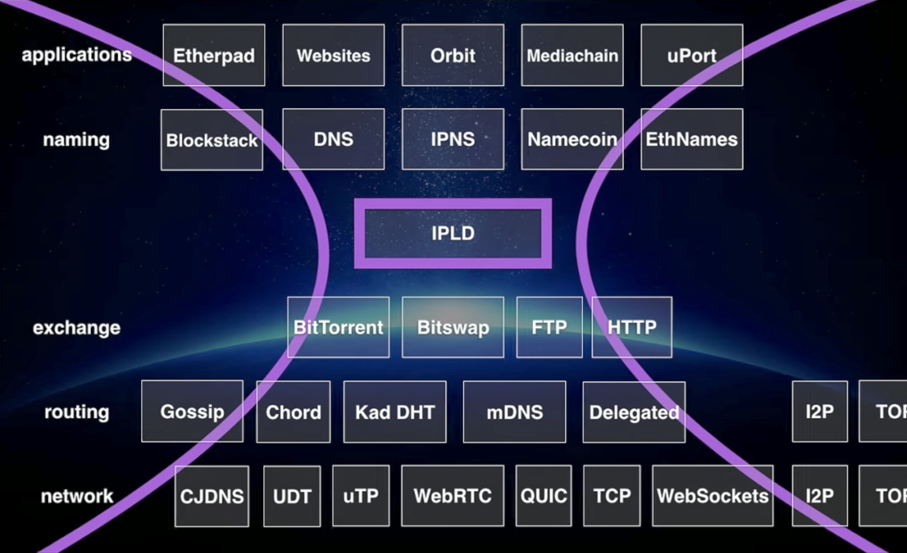

### 🤔 Thoughts About Contexting 🤔


---

### Thought Experiment

**The Magic Binary Hierarchy Of Everything**

For every question <br>"how is this represented as a binary hierarchy," <br> 
a perfect answer is there.

---

### Ask yourself!

1. How to navigate the magic hierarchy?

1. What can we do with it, then?

---

Whatever one expects to find is there. 


---

### Switch your perspective!





---

<h3 align="center"> Blockchain </h3>




---

<h3 align="center"> XOR-Metrics, e.g. Kademlia </h3>



---



---



---

### ProtoSchool

_We are a group of people <br>passionate about the decentralized web <br>and excited to learn, teach, and share ideas. 
<br>Everyone is welcome!_

supported by Protocol Labs

+++

Feature: Online Tutorials for Go developer using ```present``` ([issue](https://github.com/ProtoSchool/protoschool.github.io/issues/172))

---

<h3 align="center"> Creative Learning </h3>


---

### Installation

- IPFS

---

### Exploration

- ```ipfs``` command
- ```ipfs daemon```
- WebUI
- Gateways

---

### Exercises (1/3)

- ipfs basics
- ipfs pin
- ipns

The end of the ipns exercise is how we <br>share a public read-write directory commonly. 

- ipfs log

---

### Exercises (2/3)

- ipfs swarm
- ipfs bootstrap

The end of the bootstrap exercise is <br>how we create a private network of peers.

---

### Exercises (3/3)

- ipfs bitswap
- ipfs p2p

---

### Discussion

- Impressions
- Problems and questions
- Ideas and issues

---

### Panel

- What's next?
